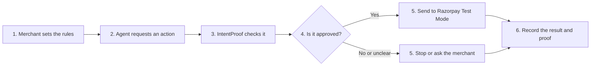

# IntentProof

> A business should not have to choose between slow manual work and giving an AI complete control over its money.

**IntentProof is a safety layer between an AI agent and Razorpay. It checks every payment action
against rules approved by the merchant before anything is sent.**

## The problem

Picture a shop owner at the end of a long day. Orders still need to be created, payments need to be
checked, and routine actions are waiting for approval. The software can prepare everything, but a
person still has to open the dashboard, read each request, and click a button.

One approval takes only a moment. Hundreds of them take hours. They interrupt real work, depend on
someone always being available, and turn automation back into another manual queue.

AI agents could remove that burden, but money is different from an email or a report. A model can
misunderstand a request, invent a missing detail, follow a malicious instruction, or repeat an
action after a timeout. A mistake here is not just a bad answer. It can become a real payment.

That is why many businesses remain stuck between two uncomfortable choices:

- **Approve everything manually:** safer, but slow and tiring.
- **Let the AI act freely:** faster, but too much trust in an unpredictable system.

Simple spending limits do not solve the full problem because they do not understand *why* a payment
is being made. Rules written only inside an AI prompt are also not enough because the same AI can
misread or ignore them.

IntentProof was built for the space between those choices.

## A safer middle path

The merchant writes clear instructions in everyday language, such as:

> Create orders up to Rs. 3,000. Keep the daily total below Rs. 25,000. Never capture a payment
> before delivery, and ask me before capturing more than Rs. 2,000.

IntentProof turns those instructions into a reviewed mandate. The AI may suggest a payment action,
but separate deterministic code decides whether it is allowed.

Every request receives one clear answer:

- `ALLOW` - continue with the action.
- `BLOCK` - stop because a rule was broken.
- `HOLD_FOR_APPROVAL` - ask the merchant before continuing.
- `ABSTAIN` - stop because important information is missing.

Only `ALLOW` can reach Razorpay. Normal work can continue automatically, while unusual or unclear
requests return to a person. The merchant keeps control without becoming the approval button for
every routine action.

## How it works



The important separation is simple: **AI proposes; IntentProof decides.**

## What the project includes

- A small payment gateway that exposes only order creation, payment-link creation, and payment
  capture.
- Merchant rules for amounts, daily usage, working hours, delivery confirmation, approval limits,
  revocation, and an emergency kill switch.
- Protection against duplicate actions and uncertain network results.
- Verified Razorpay webhooks and a tamper-evident activity record.
- A safe failure lab that tests crashes, retries, duplicate events, and timing problems without
  contacting Razorpay.
- A local Control Room for reviewing mandates, running safe examples, viewing decisions, replaying
  failures, and checking evidence.

## Try the Control Room

Install and verify the project:

```powershell
npm install
Copy-Item .env.example .env
npm test
npm run build
```

Start the local backend:

```powershell
$env:PORT = "8787"
$env:DB_PATH = ".control-room.db"
npm start
```

In another terminal, start the interface:

```powershell
npm run dev:frontend
```

Open `http://127.0.0.1:4173`.

The Control Room uses a fake compiler, planner, and payment provider. It is designed for a safe local
demonstration and does not move real money.

You can also run the command-line demonstration:

```powershell
npm run agent
```

## Safety and scope

IntentProof is a **Razorpay Test Mode prototype**. Never use live credentials, real money, or real
customer data with this project.

The current version is local, uses SQLite, and does not claim production-grade authentication or a
global exactly-once guarantee. Real Razorpay Test Mode webhook evidence is still pending and remains
clearly labelled as such. These limits are visible because trust begins with being honest about what
a system can and cannot prove.

For the complete engineering flow, see [ARCHITECTURE.md](./ARCHITECTURE.md). For detailed boundaries
and limitations, see [SAFETY.md](./SAFETY.md).
