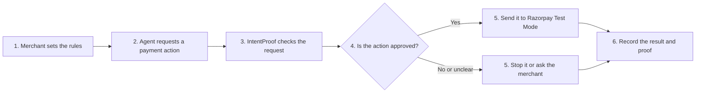
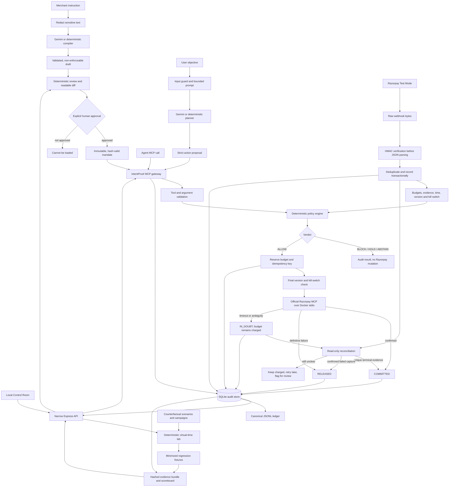

# IntentProof

> Most payment automation still stops at the final click. IntentProof makes that last step safe enough to automate.

**In one line:** IntentProof is a safety layer between an AI agent and Razorpay that checks every payment action before it is sent.

## Why payments still need so much manual work

Businesses can already automate invoices, reminders, reports, and support. The final payment step,
however, often returns to a person. Someone must open a dashboard, check the amount and purpose, and
click **Approve**. This gives the business control, but repeating it for every routine payment takes
time, adds labour, and prevents the process from running when that person is unavailable.

The obvious alternative is to let an AI agent pay directly. Many teams are not ready to do that.
Language models can misunderstand a request, hallucinate missing details, follow a malicious prompt,
or repeat an action after a timeout. When the action moves money, a confident mistake is still a
real mistake.

The common workarounds leave an important gap:

1. **Ask a human to approve every payment.** This keeps a person in control, but removes most of the
   speed and availability that an agent is meant to provide.
2. **Use simple amount or usage limits.** A fixed limit can restrict the size of an action, but it
   does not understand why the payment is being made, whether delivery was confirmed, or whether
   this particular action matches the merchant's instruction.
3. **Put the rules inside the AI prompt.** Prompt instructions are useful guidance, but the same
   model can misunderstand them or be manipulated by other text. Guidance inside the model should
   not be the final authority for moving money.

This creates a poor choice: keep every action manual, or give an unpredictable model too much trust.
IntentProof was built to create a safer middle path.

## How IntentProof closes the gap

A merchant describes the boundaries in plain language: which actions are allowed, how much may be
spent, when the agent may act, and when a person must approve. IntentProof turns those instructions
into a reviewed mandate and enforces it with deterministic code outside the AI model.

The separation is simple: **the AI may propose an action, but it never grants permission to execute
it.** Every request receives one clear result:

- `ALLOW` — the request satisfies the active mandate and may continue.
- `BLOCK` — the request breaks a known rule and is stopped.
- `HOLD_FOR_APPROVAL` — a person must approve before execution.
- `ABSTAIN` — required evidence is missing or the system cannot decide safely.

Only `ALLOW` can reach the Razorpay mutation boundary. The other three outcomes make zero upstream
mutation calls.

Routine actions can therefore continue automatically, while unusual, unsafe, or unclear actions are
stopped or returned to a person. This preserves human control without requiring a human click for
every normal request.

The project runs in **Razorpay Test Mode only**. Do not use live credentials, real money, or real
customer data.

## What is implemented

- A narrow MCP gateway for `create_order`, `create_payment_link`, and `capture_payment`.
- Deterministic checks for tool access, amount ceilings, rolling budgets, time windows, delivery
  evidence, approval thresholds, mandate versions, revocation, and a merchant kill switch.
- An offline mandate compiler that turns merchant text into a reviewable draft. Only an explicitly
  approved, hash-valid version can be loaded by the gateway.
- A constrained Gemini planner that may propose an action but has no provider credentials and no
  authority to approve it.
- Transactional budget reservations, stable idempotency keys, and durable request correlation in
  SQLite.
- Fail-closed handling of timeouts and uncertain provider results through `IN_DOUBT` state.
- Startup recovery and bounded, read-only reconciliation for uncertain mutations.
- Raw-byte Razorpay webhook signature verification, duplicate handling, and transactional updates.
- A tamper-evident audit ledger and a canonical evidence bundle with hashes and provenance labels.
- A deterministic Counterfactual Lab that explores retries, crashes, races, delayed webhooks, and
  ambiguous reads without contacting Razorpay.
- A local React Control Room for mandate review, safe agent demonstrations, audit inspection, Lab
  replay, and proof-bundle status.

## Architecture at a glance

The system has three deliberately separated parts: configuration, live enforcement, and offline
verification. The AI is useful at the edges, while deterministic code owns every decision that can
affect money.

### Simple six-phase overview



In short: the merchant defines the limits, the agent suggests an action, and IntentProof decides
whether it may continue. Every outcome is recorded.

### Detailed system flow



### The payment path, in simple words

1. An agent asks IntentProof to perform one supported payment action.
2. IntentProof validates the request and checks it against the approved merchant rules.
3. A denied, uncertain, or approval-required request stops before Razorpay.
4. An allowed request reserves its budget before the network call begins.
5. A confirmed result is committed; a definite failure releases the reservation.
6. An unclear result remains charged until read-only evidence or a verified webhook resolves it.
7. Every important decision and state change is written to the audit store.

## Quick start

### Requirements

- Node.js 24 or later
- npm
- Docker, when using the official Razorpay MCP server
- Razorpay Test Mode credentials, only for the optional provider probes
- A Gemini API key, only for the optional live compiler or planner smoke test

### Install and verify

```powershell
npm install
Copy-Item .env.example .env
npm test
npm run build
```

Keep `.env` local and never commit it. The repository rejects a Razorpay key ID unless it begins
with `rzp_test_`.

## Control Room

The Control Room is a React and TypeScript interface over narrowly scoped Express endpoints. The
browser never receives credentials, raw webhook bodies, database rows, or policy authority. Drafts
use the deterministic fake compiler, agent proposals use the constrained fake planner, all verdicts
come from the existing gateway and policy engine, and upstream execution is fake-only.

Keep the webhook listener on its existing port. Run a second local backend instance on a separate
port, then start Vite on port 4173:

```powershell
$env:PORT = "8787"
$env:DB_PATH = ".control-room.db"
npm start
```

In another terminal:

```powershell
npm run dev:frontend
```

Open `http://127.0.0.1:4173`. The Vite server proxies only `/api` requests to the local Control Room
backend. The Evidence screen deliberately preserves the genuine webhook as
`PENDING_EXTERNAL_REPLAY` until real signed evidence exists.

### See the safe agent flow

```powershell
npm run agent
```

This deterministic demonstration covers allowed, blocked, held, abstained, kill-switch, and stale
mandate-version cases. It also reports the upstream-call count and relevant audit evidence.

### See model planning without payment access

```powershell
npm run planner:demo
```

The planner can return only one of the three supported actions or `no_action`. Its output is treated
as an untrusted proposal, validated locally, and then passed through the same gateway and policy
checks as any other agent request.

For an optional Gemini planning-only smoke test:

```powershell
npm run planner:smoke -- --objective "Place an order for 19900 paise."
```

Set `LLM_API_KEY` in the process environment first. This command has no gateway, dispatcher, MCP, or
upstream client dependency, so it cannot contact Razorpay.

## Create and approve a merchant mandate

The compiler is outside the payment path. A draft remains non-enforceable until a named person
reviews and approves it.

```powershell
npm run mandate -- draft --input examples/mandates/shop-owner.txt --provider fake --output mandate-draft.json
npm run mandate -- review mandate-draft.json
npm run mandate -- approve mandate-draft.json --approved-by demo-merchant --output mandate-approved.json
npm run mandate -- diff mandates/default.yaml mandate-approved.json
```

Use `--provider gemini` with `LLM_API_KEY` to use the live compiler. Only the redacted merchant
instruction is sent to the model. Payment arguments, audit rows, webhook data, approval state, and
Razorpay credentials are excluded.

Generated output must match a strict schema. Unknown fields, unsupported instructions, ambiguous
sentences, missing source coverage, invented quotes, malformed output, and provider timeouts all
fail closed. Approval records the reviewer, assigns a version, preserves draft provenance, and
writes a create-once artifact with a deterministic content hash.

## Run the gateway and webhook intake

Start the narrow MCP gateway over standard input/output:

```powershell
npm run gateway
```

Start webhook intake after setting `WEBHOOK_SECRET`:

```powershell
npm run dev
```

Available HTTP endpoints:

- `GET /health` — confirms that the webhook service is running.
- `POST /webhook` — verifies the Razorpay signature from the original request bytes before parsing.

The webhook handler accepts the current secret and an optional previous secret for rotation. Invalid
signatures, invalid JSON, missing event IDs, unsupported events, and duplicate deliveries are
recorded without creating a payment mutation.

## Test Mode provider probes

Inspect the official local Razorpay MCP server and save only sanitized evidence:

```powershell
npm run probe:upstream
```

The probe lists the available upstream tools and performs a one-item payment read. It does not store
credentials or the response body.

Run the intentionally one-shot mutation probe:

```powershell
npm run probe:gateway
```

It creates one INR 1 Test Mode order and confirms that each non-`ALLOW` verdict produces zero
upstream calls. It refuses to run again after `evidence/gateway-pass-through.json` exists.

## Recovery and reconciliation

Every allowed mutation receives an idempotency key. A caller may provide a stable business key; if
it does not, IntentProof derives one from the mandate, agent, tool, canonical arguments, and a
five-minute time window. Reusing a key returns its stored state instead of dispatching again. Reusing
the same key for different arguments is blocked.

Before dispatch, IntentProof stores a durable correlation value: an order receipt, a payment-link
reference ID, or the payment ID used for capture. After a restart:

- A stale reservation that was never claimed for dispatch can be released safely.
- A stale claimed reservation becomes `IN_DOUBT`, because Razorpay may have received it.
- The reconciler uses only `fetch_all_orders`, `fetch_all_payment_links`, and `fetch_payment`.
- Missing, delayed, malformed, or conflicting reads never free the budget.
- A still-uncertain request remains charged, is scheduled for another check, and is flagged for
  human review.

## Counterfactual Lab

The Lab reproduces difficult timing and failure cases with a virtual clock and an in-memory fake
provider. It has no Razorpay transport.

```powershell
npm run lab -- run scenarios/lab/timeout-after-acceptance.json
npm run lab -- replay scenarios/lab/webhook-reconciler-race.json --seed 808
npm run lab -- explore campaigns/lab/unsafe-retry.json
npm run lab -- reproduce regressions/lab/unsafe-retry-discovery-one_intent_one_effect.json
```

The checked-in scenarios cover timeout after acceptance, duplicate and out-of-order webhooks,
retries, crash and restart, revocation during dispatch, malformed reads, and webhook/reconciler
races. Exploration walks bounded event schedules, checks safety invariants, and minimizes the first
failure into a reproducible regression fixture. The fixture is run against both an intentionally
unsafe reference model and the guarded IntentProof model.

## Audit and evidence

Export and verify the tamper-evident ledger:

```powershell
npm run export:ledger
npm run verify:ledger
```

Build, verify, and score a sanitized proof bundle:

```powershell
npm run evidence -- build --output evidence/bundle
npm run evidence -- verify evidence/bundle/manifest.json
npm run evidence -- score evidence/bundle/manifest.json
```

The bundle contains canonical JSON summaries, SHA-256 hashes, a manifest digest, test and build
results, ledger verification, and explicit provenance. Evidence is labelled as real Test Mode,
mocked Gemini, deterministic fake, synthetic chaos, local verification, or pending external replay.
Synthetic data cannot be presented as genuine Razorpay webhook evidence.

Use `--created-at <ISO-8601>` for a chosen reproducible timestamp. Otherwise the builder uses the
checked-out commit time so the same inputs produce the same bytes.

## Project map

```text
src/agent/           Safe demo agent and planner-to-gateway composition
src/budget/          Reservation and dispatch state types
src/control-room/    Local API and orchestration for the operator interface
src/executor/        Budgeted, idempotent mutation lifecycle
src/gateway/         Narrow MCP surface and policy boundary
src/intake/          Raw webhook verification and privacy helpers
src/lab/             Deterministic replay, exploration, invariants, and minimization
src/ledger/          SQLite audit store, canonical export, and verification
src/llm/             Redaction and mandate compiler providers
src/mandate/         Draft, review, approval, hashing, and mandate loading
src/planner/         Strict model proposal layer
src/policy/          Deterministic policy evaluation
src/reconciliation/  Read-only resolution of uncertain mutations
src/upstream/        Official Razorpay MCP client and sanitization
evidence/            Sanitized checked-in proof artifacts
scenarios/lab/       Reproducible failure scenarios
regressions/lab/     Minimized discovered failures
tests/               Unit and integration coverage
web/                 React and TypeScript Control Room
```

For a deeper technical description, see [ARCHITECTURE.md](./ARCHITECTURE.md). For the explicit
safety boundary, see [SAFETY.md](./SAFETY.md).

## Current verification status

- The strict TypeScript build, automated test suite, audit export, ledger verification, gateway
  boundary, executor lifecycle, reconciliation, mandate approval, planner validation, Lab replay,
  evidence bundle, and local Control Room are implemented.
- A credentialed `fetch_all_payments` Test Mode read and one INR 1 Test Mode order have sanitized
  checked-in evidence.
- A genuine Razorpay Test Mode webhook replay still depends on an external delivery and remains
  visibly marked `PENDING_EXTERNAL_REPLAY`.

## Honest limits

- IntentProof is a local Test Mode prototype, not a production payment authorization service.
- The Control Room uses deterministic fake compiler, planner, and upstream components; its browser
  interface is a local demonstration, not a production operations console.
- Its SQLite idempotency boundary does not provide a global exactly-once guarantee.
- Razorpay MCP read responses do not publish a complete output schema, so unfamiliar shapes remain
  `IN_DOUBT`.
- Read-after-write timing and payment-link pagination behavior have not been established here.
- The Counterfactual Lab is bounded model checking, not exhaustive verification or Razorpay API
  conformance testing.
- The compiler supports a fixed rule vocabulary; it is not a general natural-language policy
  language.
- CLI approval records a local asserted identity. It is not authentication or a digital signature.
- Evidence hashes reveal changes but do not prove authorship or provider origin.
- A host failure in the small gap after the final dispatch check and before the network call still
  requires reconciliation.

These limits are kept visible because safe automation depends as much on stating what is unknown as
on demonstrating what works.
